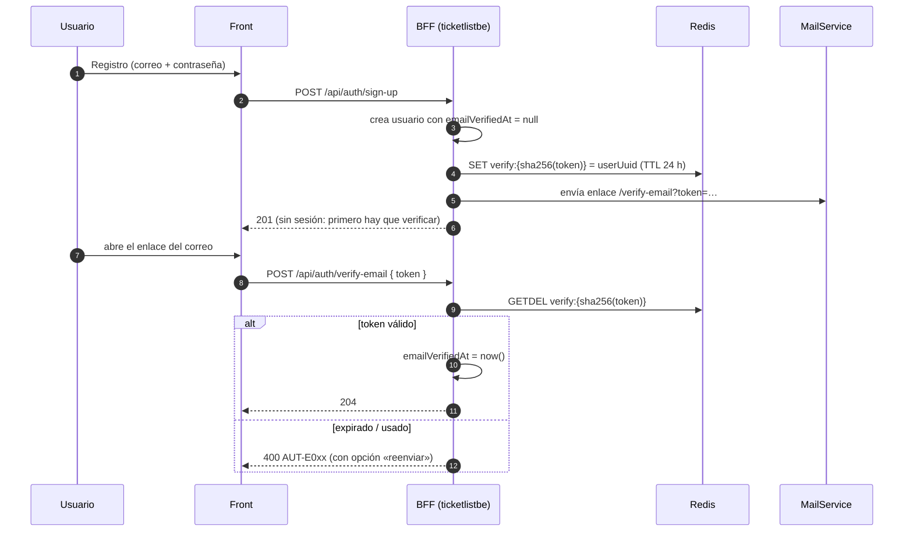
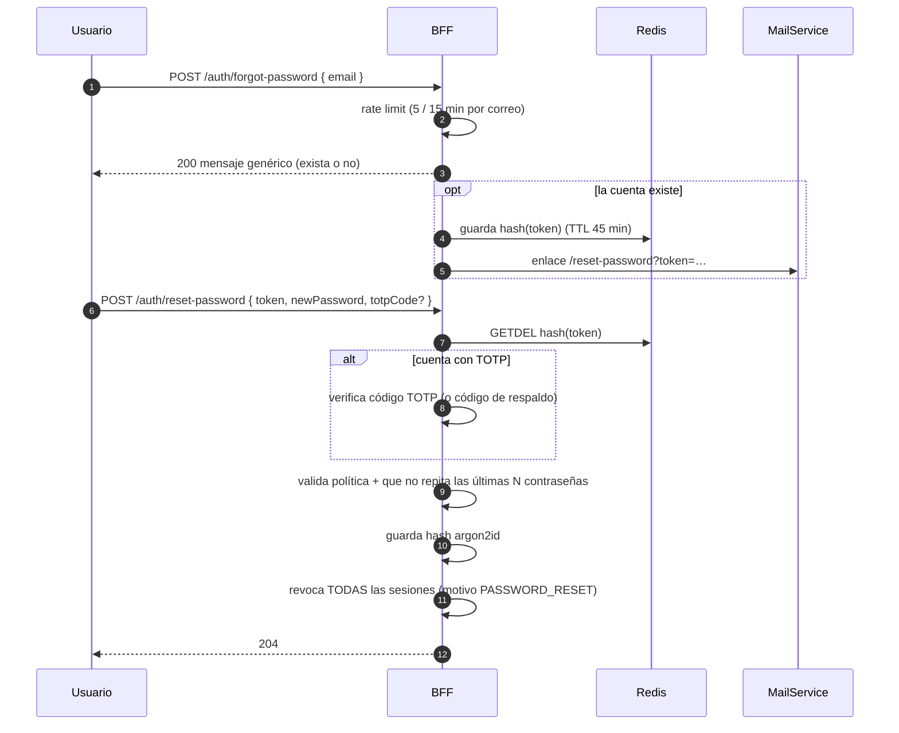
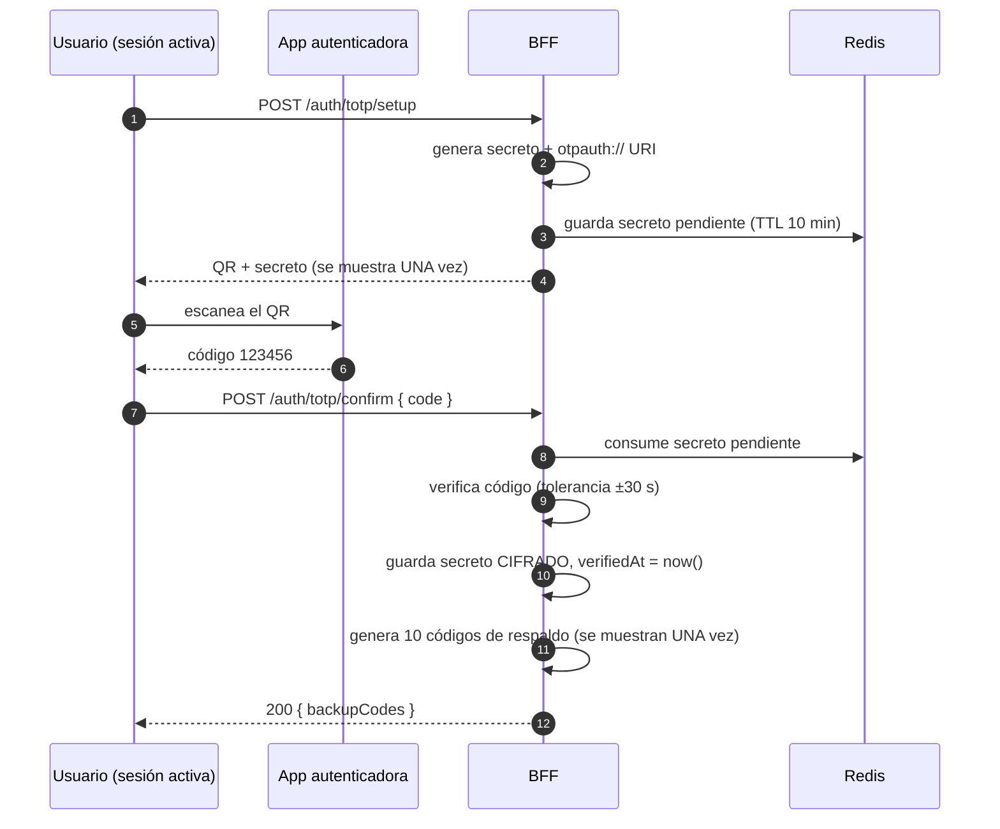
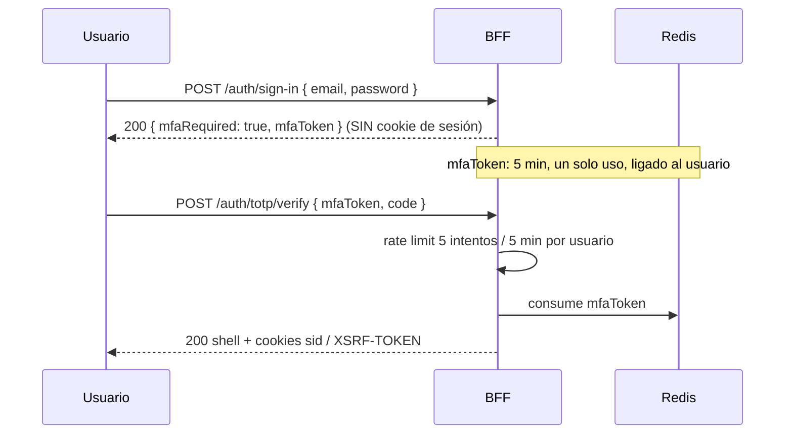
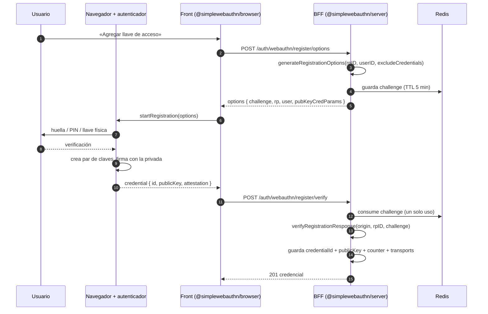
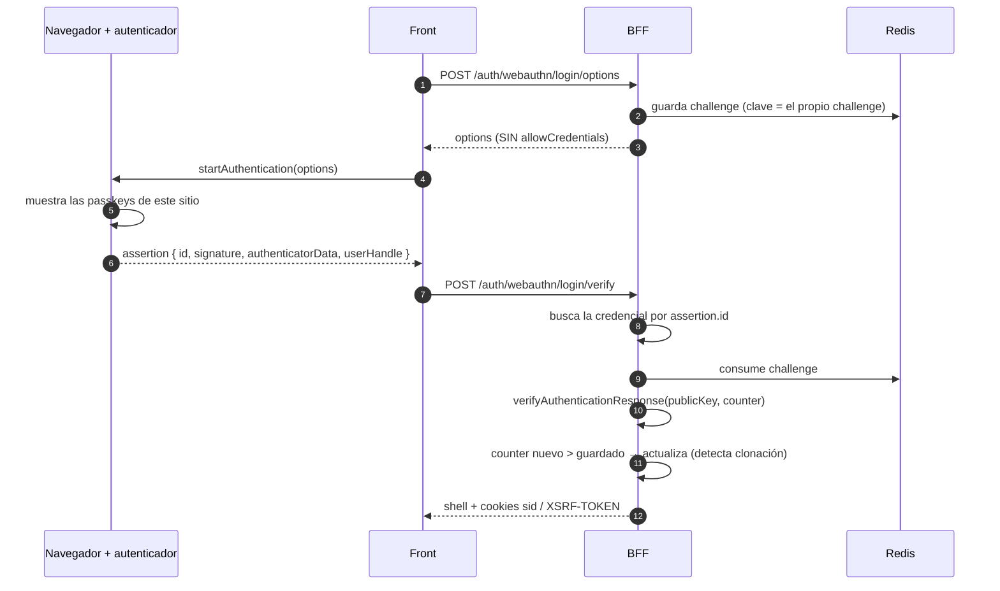
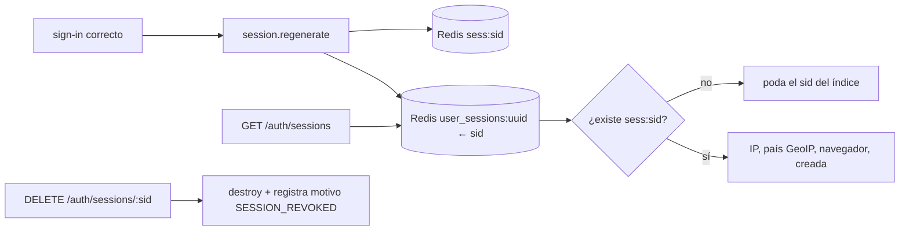

# Flujos de autenticación — verificación de correo, recuperación, MFA TOTP, códigos de respaldo, WebAuthn, sesiones y rate limiting

> Diseño de referencia para ticketlistbe, basado en el comportamiento real de wallet-api
> (`apps/api/src/modules/auth/*`). Cada sección dice **qué se hereda** y **qué cambia** aquí.
> Los diagramas son Mermaid (se ven en GitHub, VS Code y Scalar no los necesita).

## 0. Principios comunes

| Principio | Cómo se aplica |
|---|---|
| **Un solo uso** | Todo token temporal (challenge WebAuthn, setup TOTP, reset, verificación) se guarda en un `SingleUseTokenStore` (Redis `GETDEL`) y se consume al verificar. |
| **Anti-enumeración** | `forgot-password` y `resend-verification` responden SIEMPRE el mismo mensaje exista o no el correo. |
| **Rate limit por cuenta, no solo por IP** | Contador con ventana fija (`incrementWithTtl`): el primer intento fija el TTL; los siguientes no lo extienden. |
| **Errores del catálogo** | Todo falla con `CustomBusinessException(ERROR_CODES.AUT.*)` → RFC 9457. `429` lleva `context.retryAfterSeconds` y la cabecera `Retry-After`. |
| **Nada secreto en logs ni en el front** | Secretos TOTP cifrados (`SymmetricEncryptionService`), códigos de respaldo y tokens solo como hash. |

---

## 1. Verificación de correo

Wallet-api no la tiene (el correo se acepta sin comprobar). Aquí se agrega con el mismo patrón que
el reset de contraseña.

> **Estado: implementado** (`AccountRecoveryService`, `AccountRecoveryController`, e2e `recovery.e2e-spec.ts`). El correo sale por `IMailService`; hoy el único adaptador es `LogMailService` (escribe el enlace en el log y lo devuelve como `devUrl` fuera de producción). Para producción falta un adaptador SMTP/API (Resend, Mailgun…) que implemente la misma interfaz.

- El token son 32 bytes aleatorios; en Redis solo vive su **hash** (si se filtra Redis no sirve).
- `POST /api/auth/resend-verification`: mismo mensaje siempre, con rate limit (3 por hora por correo).
- Sin verificar no se puede iniciar sesión (`SAUT-E006`), salvo en desarrollo con `MAIL_MODE=log`.
- `MailService` es una interfaz con dos adaptadores: **log** (desarrollo: imprime el enlace y lo
  devuelve en `devUrl`) y **SMTP** (producción, por variables de entorno).

## 2. Recuperación de contraseña

> **Estado: implementado** junto con la verificación (ver §1). El token no se consume si la contraseña nueva es débil (la validación del DTO corre antes), y al completar se cierran todas las sesiones de la cuenta y se da el correo por verificado. Pendiente: pedir el segundo factor cuando exista TOTP, y el historial de contraseñas.

Heredado: token de un solo uso (45 min), rate limit, **cierre de todas las sesiones** al completar,
y verificación de segundo factor si la cuenta lo tiene.

Por qué cerrar todas las sesiones: quien completó el reset pudo no ser el dueño de las sesiones
abiertas (alguien con la sesión robada sigue dentro).

## 3. MFA TOTP (RFC 6238)

El servidor y la app autenticadora (Google Authenticator, Authy…) comparten un **secreto**; ambos
derivan el mismo código de 6 dígitos a partir de él y de la hora (ventana de 30 s).

**Login con TOTP** (dos pasos, sin sesión a medias):

Decisión de diseño: **no se crea sesión parcial.** Hasta pasar el segundo factor no existe cookie
`sid`, así que no hay endpoint protegido que pueda quedar expuesto por error.

## 4. Códigos de respaldo

- 10 códigos de 6 bytes (12 hex), se muestran **una sola vez**; en BD solo el hash (argon2id).
- Cada uno se consume al usarse (`consumedAt`). `GET /auth/backup-codes/remaining` devuelve cuántos quedan.
- Regenerar invalida los anteriores y exige sesión + TOTP vigente.
- Rate limit propio: 5 intentos / 15 min por correo (los códigos tienen menos entropía que una contraseña larga).
- Sirven en el login y en la recuperación de contraseña cuando se perdió el dispositivo.

## 5. WebAuthn / passkeys

Es **criptografía de clave pública**: el dispositivo crea un par de claves; el servidor guarda solo
la **pública**. Para entrar, el dispositivo firma un *challenge* aleatorio del servidor. No hay
secreto compartido que robar, y la credencial queda atada al dominio (`rpID`), así que un sitio
falso no puede pedirla (anti-phishing).

### 5.1 Registro (usuario con sesión)

### 5.2 Login «discoverable» (sin escribir el correo)

Por qué no se pide `allowCredentials`: así el formulario no revela si un correo tiene llave
registrada, y el usuario elige entre todas sus passkeys.

### 5.3 Parámetros que no se pueden cambiar a la ligera

| Parámetro | Valor | Nota |
|---|---|---|
| `rpID` | dominio sin protocolo (`localhost` en dev) | **Nunca cambiarlo con credenciales reales:** el navegador las ata a este valor. |
| `origin` | URL completa del front | Se verifica en cada respuesta. |
| `attestationType` | `none` | No se necesita saber marca/modelo del autenticador. |
| `userVerification` | `preferred` | Pide huella/PIN si está disponible. |
| `userID` | uuid del usuario en bytes | Nunca el correo (no filtra datos personales dentro de la credencial). |

> Los errores del navegador (`NotAllowedError`, usuario cancela) **no pasan por el interceptor
> HTTP**: el front debe distinguirlos de los `HttpErrorResponse`.

## 6. Gestión de sesiones

La sesión vive en Redis (`sess:{sid}`) y un índice secundario `user_sessions:{userUuid}` (Set de
sids) permite listar y revocar por usuario, porque `connect-redis` solo indexa por sid.

| Función | Detalle |
|---|---|
| **Mis sesiones** | Lista con país (GeoIP), navegador y fecha; marca la actual; «Cerrar esta sesión» y «Cerrar las demás». |
| **Historial** | `session_history`: inicio, fin y **motivo** (`sign_out`, `new_session`, `session_revoked`, `password_reset`, expirada). |
| **Login history** | Cada intento (correcto o no) con método (`password`, `webauthn`, `totp`) e IP. |
| **Admin** | Lista y revoca sesiones de cualquier usuario (permiso `manage Session`), y queda en auditoría. |
| **Vida** | 30 min de inactividad (`rolling`) y tope absoluto de 7 días (ya implementado). |

## 7. Rate limiting

Dos capas distintas, porque protegen cosas distintas:

| Capa | Mecanismo | Qué frena | Respuesta |
|---|---|---|---|
| **Por IP (global)** | `ThrottlerGuard` con store en Redis | Barridos y ráfagas de cualquier endpoint | `429` + `Retry-After` |
| **Por cuenta** | Contador Redis con ventana fija | Adivinar la contraseña, el TOTP o un código de respaldo de **una** cuenta desde muchas IPs | `429` `AUT-E0xx` + `retryAfterSeconds` |

Límites iniciales (los de wallet-api):

| Operación | Máximo | Ventana | Clave |
|---|---|---|---|
| Login (cuenta) | 10 | 15 min | correo |
| Login (global) | 100 | 1 min | — |
| TOTP | 5 | 5 min | usuario |
| Código de respaldo | 5 | 15 min | correo |
| Recuperar contraseña | 5 | 15 min | correo |
| Reenviar verificación | 3 | 60 min | correo |

Tras un éxito el contador de esa cuenta se reinicia. Con Redis caído el límite **falla cerrado**
en endpoints de autenticación (mejor bloquear el login que dejarlo sin freno).
