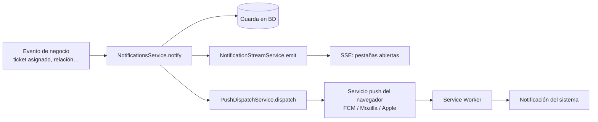
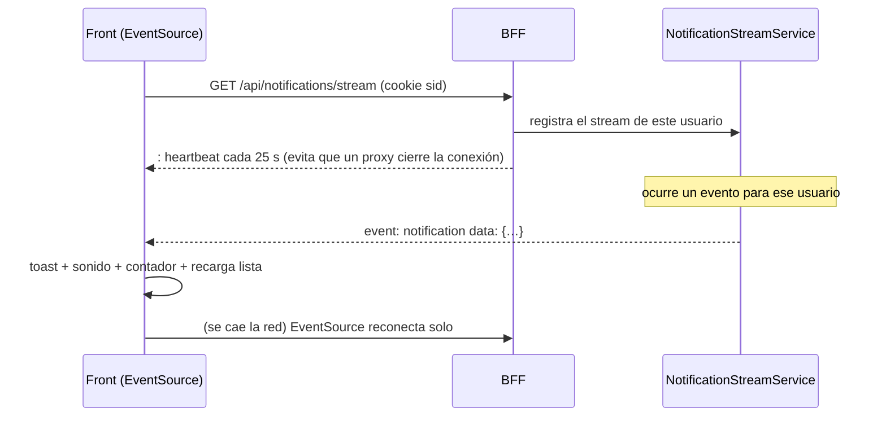
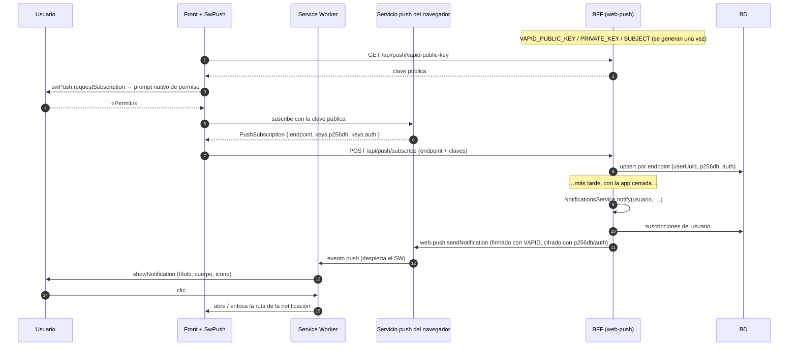

# Notificaciones en tiempo real (SSE), Web Push y PWA

> Basado en `wallet-api/docs/design/push-notifications-pwa.md` (implementado y probado en Chrome y
> Firefox). Aquí se explica el **porqué** de cada pieza, para decidir qué traer.

## 1. Tres canales, tres alcances

| Canal | Funciona con… | Tecnología | Para qué |
|---|---|---|---|
| **In-app** (ya existe) | Pestaña abierta, al pedir | `GET /api/notifications` | Historial y contador |
| **SSE** | Pestaña **abierta** | `text/event-stream` (HTTP largo, un solo sentido) | Aviso instantáneo: toast + sonido + contador |
| **Web Push** | App **cerrada** | Push API + Service Worker + VAPID | Aviso del sistema operativo |

Regla de oro: **cada notificación se guarda una vez** (`NotificationsService.notify`) y desde ahí
se reparte a los canales. Los tipos de notificación existentes heredan SSE y Push sin tocar a quien
los dispara.

## 2. SSE (Server-Sent Events)

El navegador abre **una** conexión `GET /api/notifications/stream` y el servidor la mantiene
abierta enviando eventos. Es más simple que WebSocket porque solo va en un sentido y reconecta solo.

Puntos finos:
- **Aislamiento:** el stream solo recibe las notificaciones de **su** usuario (sale de la sesión, nunca de un parámetro).
- **Heartbeat** cada ~25 s: Caddy/Traefik y los balanceadores cortan conexiones ociosas.
- **Un proxy Node crudo** debe escuchar `res.on('close')`, no `req.on('close')` (este último se dispara al terminar de leer el request, no al desconectarse el cliente).
- Con varias réplicas del BFF el `emit` en memoria no alcanza: hay que publicar por **Redis pub/sub**.
- `Cache-Control: no-store` y `X-Accel-Buffering: no` para que nada lo acumule.

## 3. PWA (Progressive Web App)

Una PWA es la misma web con tres piezas: **manifest** (nombre, íconos, colores → instalable),
**Service Worker** (un script que vive aparte de la página y puede ejecutarse con ella cerrada) y
**HTTPS**.

| Pieza | Archivo | Qué hace |
|---|---|---|
| Manifest | `public/manifest.webmanifest` | Nombre, `theme_color`, íconos 192/512 + *maskable* → el navegador ofrece «Instalar». |
| Service Worker | `ngsw-worker.js` (lo genera Angular) | Cachea el *app shell* (abre sin red), recibe eventos `push`. |
| Config | `ngsw-config.json` | `assetGroups` (qué precargar/cachear) y `navigationUrls` (**excluye `/api/**`** del redireccionamiento a `index.html`). |
| Registro | `provideServiceWorker('ngsw-worker.js', { enabled: !isDevMode() })` | `ng serve` **nunca** activa el SW, a propósito. |

Para probarlo hay que servir el **build de producción** con un servidor real y limpiar el SW viejo
(DevTools → Application → *Unregister* + *Clear site data*) en cada cambio.

## 4. Web Push paso a paso

La **Push API** necesita un Service Worker: es él quien recibe el evento con la pestaña cerrada.
El mensaje no viaja directo del BFF al usuario: pasa por el **servicio push del navegador**
(Google FCM en Chrome, Mozilla en Firefox, Apple en Safari). Las claves **VAPID** identifican a tu
servidor ante ese servicio.

### Lo que hay que respetar

| Detalle | Por qué |
|---|---|
| Payload `{ "notification": { title, body, icon, tag, data } }` | `ngsw-worker.js` **solo** muestra lo que viene bajo esa clave; si no, no pasa nada y no hay error visible. |
| `PushSubscription.toJSON()` trae `expirationTime` | El DTO debe aceptarlo (es parte del estándar W3C). |
| Upsert por `endpoint` | Un navegador puede re-suscribirse con claves nuevas. |
| Limpiar suscripciones **404/410** | El usuario revocó el permiso o desinstaló: se borran solas. |
| `Promise.allSettled` y *fire-and-forget* | Un push caído nunca debe romper la operación de negocio. |
| `getOrThrow` de las claves VAPID | La app no arranca sin ellas (sin «fallback inseguro»). |
| `apiOrigin` | Si front y API tienen origen distinto en una prueba local, hay que ajustarlo y **revertirlo** antes de desplegar. |
| Errores del SW/Push API | **No son HTTP**: el interceptor no los ve; se manejan con toast propio. |
| iOS | Solo funciona si la PWA está **instalada** en pantalla de inicio (iOS 16.4+). |

### Experiencia de usuario

1. Banner «¿Activar avisos?» al iniciar sesión (con «Ahora no» persistido).
2. Preferencias del perfil: activar/desactivar por dispositivo y elegir **qué tipos** avisan.
3. Sonido de notificación configurable (con respeto a «reducir movimiento»/silencio del sistema).
4. Centro de notificaciones: lista, marcar leída, marcar todas, contador en la barra superior.

## 5. Lo que se agrega en ticketlistbe / ticketkanban

| Pieza | Backend | Front |
|---|---|---|
| SSE | `GET /api/notifications/stream` + `NotificationStreamService` (+ pub/sub Redis) | `NotificationStreamService` (`EventSource`), toast + sonido |
| Centro | `GET /api/notifications`, `PATCH /:uuid/read`, `POST /read-all` | Panel desplegable en la barra superior + página |
| Preferencias | `notification_preferences` por usuario y tipo (in-app / push / sonido) | Pantalla del perfil |
| Push | `push_subscriptions`, `PushDispatchService`, `/api/push/*` | `SwPush`, banner, `ngsw-config.json`, manifest, íconos |
